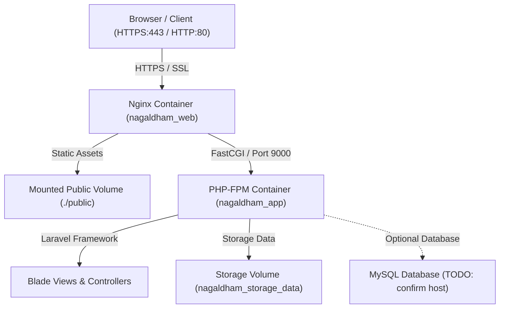
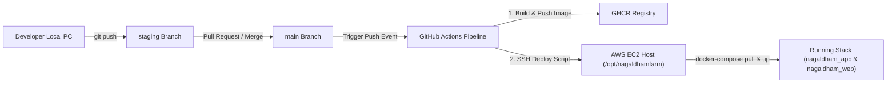

# Nagaldham Farm

Nagaldham Farm is an e-commerce web application dedicated to showcasing and selling 100% natural Gir Cow products, A2 Bilona Ghee, organic farm produce (wheat, pulses, cold-pressed oils), and traditional Indian sweets. Built for customers seeking pure, unadulterated farm products and sacred Gaushala items, the platform features catalog browsing, detailed product views, category navigation, and responsive SEO-optimized marketing pages.

## 1. Tech Stack

| Component | Technology | Version / Base Image | Notes |
|---|---|---|---|
| Language | PHP | 8.4-FPM Alpine | Multi-stage build in production Dockerfile |
| Framework | Laravel | 10.x | Web routing, Blade templating, Artisan CLI |
| Web Server | Nginx | 1.27-Alpine | Reverse proxy, static asset handler, SSL termination |
| Frontend Assets | Vite / Tailwind CSS / Vanilla CSS | Vite 4.x / Asset Pipeline | Static image & CSS asset compilation |
| Containerization | Docker & Docker Compose | Docker Engine 20.10+ / Compose v2.27.0 | Containerized app & web services |
| CI/CD Pipeline | GitHub Actions | actions/checkout@v4, build-push-action@v6, ssh-action@v1.2.0 | Automated build and deploy on push to main |
| Container Registry | GitHub Container Registry (GHCR) | `ghcr.io/aryanbhuva/nagaldhamfarm` | Private image registry |
| Hosting Infrastructure | AWS EC2 | Ubuntu 22.04 LTS | Standalone low-RAM virtual machine |
| Database | MySQL / MariaDB | TODO: confirm | MySQL driver configured in `.env` |
| Queue System | Sync | `QUEUE_CONNECTION=sync` | Synchronous queue processing |

---

## 2. Project Architecture

### Component Architecture Diagram



### Request Flow Overview

1. **Incoming Request:** An HTTP/HTTPS request arrives at host port 80 or 443 on the AWS EC2 server.
2. **Reverse Proxy Handling:** Nginx inside container `nagaldham_web` terminates SSL (using Let's Encrypt certificates from `/etc/letsencrypt`) and evaluates the requested URI.
3. **Static File Serving:** Requests for static assets (`/assets/img/*`, `/assets/css/*`, `/assets/js/*`) are served directly from the bind-mounted `./public` directory.
4. **PHP Execution:** Dynamic requests (`/`, `/products`, `*.php`) are forwarded over FastCGI to container `nagaldham_app` at `app:9000`.
5. **Laravel Processing:** `PageController` processes the request, loads product data structures, renders Blade view templates (`front.home`, `front.product`), and returns the HTTP response.

---

## 3. GitHub / Source Control Architecture

### Repository Layout & Branching Strategy

* **`staging`:** Primary development integration branch. Feature development and local container testing occur on this branch.
* **`main`:** Production deployment branch. Pushing or merging code into `main` automatically triggers the production CI/CD workflow.



---

## 4. Complete File and Folder Structure

```
nagaldhamfarm/
├── .github/
│   └── workflows/
│       └── deploy.yml
├── app/
│   ├── Console/
│   ├── Exceptions/
│   ├── Http/
│   │   ├── Controllers/
│   │   │   └── Front/
│   │   │       └── PageController.php
│   │   └── Middleware/
│   ├── Models/
│   └── Providers/
├── bootstrap/
│   ├── app.php
│   └── cache/
├── config/
├── database/
│   ├── factories/
│   ├── migrations/
│   └── seeders/
├── deploy/
│   ├── deploy.sh
│   └── rollback.sh
├── docker/
│   ├── entrypoint.sh
│   ├── nginx/
│   │   └── default.conf
│   └── php/
│       ├── php.ini
│       └── www.conf
├── docker-developer/
│   ├── docker-compose.dev.yml
│   ├── Dockerfile.dev
│   ├── Makefile
│   ├── nginx.dev.conf
│   └── README.md
├── public/
│   ├── assets/
│   │   ├── css/
│   │   ├── img/
│   │   └── js/
│   ├── build/
│   └── index.php
├── resources/
│   ├── css/
│   ├── js/
│   └── views/
├── routes/
│   └── web.php
├── scripts/
│   └── bootstrap_server.sh
├── storage/
├── .dockerignore
├── .env.example
├── .env.production.example
├── docker-compose.build.yml
├── docker-compose.yml
├── Dockerfile
├── Makefile
├── README.md
└── docker_setup.md
```

### Directory & File Function Reference

| Path | Purpose |
|---|---|
| `.github/workflows/deploy.yml` | GitHub Actions workflow automating build, push to GHCR, and SSH deployment to EC2 |
| `app/Http/Controllers/Front/PageController.php` | Main controller rendering frontend pages (`home` and `product`) with product catalog data |
| `bootstrap/` | Laravel framework instantiation and route/config cache directory |
| `config/` | Application configuration directory (app, database, mail, filesystems) |
| `database/` | Database schema migrations, model factories, and database seeders |
| `deploy/deploy.sh` | Remote deployment script executed on EC2 during CI/CD (pulls image, restarts stack, polls health) |
| `deploy/rollback.sh` | Remote manual rollback script to restore previous container image tag |
| `docker/entrypoint.sh` | PHP-FPM container entrypoint script (manages storage symlink and Laravel caching) |
| `docker/nginx/default.conf` | Production Nginx server block configuration for domain `nagaldhamfarm.shop` with SSL |
| `docker/php/php.ini` | Production PHP runtime configuration overrides |
| `docker/php/www.conf` | PHP-FPM worker pool configuration including FPM ping status path |
| `docker-developer/docker-compose.dev.yml` | Developer Docker Compose configuration with live code bind-mounting |
| `docker-developer/Dockerfile.dev` | Development PHP 8.4-FPM Alpine Dockerfile with Composer included |
| `docker-developer/Makefile` | Shortcut commands for managing local developer containers |
| `docker-developer/nginx.dev.conf` | Local development Nginx server block configuration |
| `public/` | Web server document root containing index.php and static assets (images, CSS, JS) |
| `resources/views/` | Blade templates (`front/home.blade.php`, `front/product.blade.php`) |
| `routes/web.php` | Web route definitions (`/` and `/products`) |
| `scripts/bootstrap_server.sh` | Idempotent one-time EC2 server bootstrapping script |
| `Dockerfile` | Multi-stage production Dockerfile compiling assets and building PHP 8.4-FPM container |
| `docker-compose.yml` | Main production Docker Compose specification for `app` and `web` services |
| `docker-compose.build.yml` | Local build override file for building production images locally |
| `Makefile` | Master Makefile for production container building and key generation |
| `README.md` | Master technical documentation file |
| `docker_setup.md` | Complete Developer & Production Docker deployment guide |

---

## 5. Configuration

### Environment Files

* **`.env.example`:** Template for local development environment configuration.
* **`.env.production.example`:** Template for production EC2 environment configuration.

### Environment Variables Table

| Variable | Purpose | Required | Example / Placeholder |
|---|---|---|---|
| `APP_NAME` | Application name used in views and emails | Yes | `"Nagaldham Farm"` |
| `APP_ENV` | Environment type (`local` or `production`) | Yes | `production` |
| `APP_KEY` | Laravel 32-byte encryption key | Yes | `base64:<GENERATED_BASE64_KEY>` |
| `APP_DEBUG` | Display debug trace errors (`true` or `false`) | Yes | `false` |
| `APP_URL` | Base application URL | Yes | `https://nagaldhamfarm.shop` |
| `HTTP_PORT` | Host port for Nginx HTTP binding | Yes | `8085` |
| `IMAGE_TAG` | Docker image tag deployed by CI/CD | Yes | `latest` |
| `DB_CONNECTION` | Database driver | No | `mysql` |
| `DB_HOST` | Database host | No | `127.0.0.1` |
| `DB_PORT` | Database port | No | `3306` |
| `DB_DATABASE` | Database name | No | `nagaldham_db` |
| `DB_USERNAME` | Database username | No | `nagaldham_user` |
| `DB_PASSWORD` | Database user password | No | `<DB_PASSWORD>` |
| `LOG_CHANNEL` | Logging target output (`stack` or `stderr`) | Yes | `stderr` |

---

## 6. Detailed System Mechanics

* **PageController (`app/Http/Controllers/Front/PageController.php`):** Contains hardcoded catalog arrays (`Gaushala Products`, `Sweets`, `Organic Farm Products`) with product images, descriptions, ratings, and meta tags. Serves the `home()` and `product()` methods.
* **Health Checks:** Container health is verified via `/ping` endpoints configured in `docker/php/www.conf` and `docker/nginx/default.conf`.
* **Cron & Queues:** Currently configured for synchronous processing (`QUEUE_CONNECTION=sync`). TODO: confirm if background worker or scheduler cron is required.

---

## 7. Quick Start

For detailed step-by-step setup instructions for both local development and production deployment, refer to [docker_setup.md](file:///home/vishmay/Desktop/project/docker_setup.md).

---

## 8. Common Commands Cheat Sheet

### Production Commands

```bash
# Build production images locally
make build

# Start production containers
make up

# Stop production containers
make down

# View real-time container logs
make logs

# Access interactive bash prompt inside app container
make shell

# Generate application key in .env
make key
```

### Local Developer Commands

```bash
# Start local developer stack
make -f docker-developer/Makefile up

# Stop local developer stack
make -f docker-developer/Makefile down

# Rebuild local developer stack
make -f docker-developer/Makefile build

# View local developer logs
make -f docker-developer/Makefile logs

# Access bash shell in local dev container
make -f docker-developer/Makefile shell

# Run artisan command locally
make -f docker-developer/Makefile artisan CMD="migrate"
```

---

## 9. Troubleshooting

### Docker Socket Permission Denied

If you encounter `permission denied while trying to connect to the Docker daemon socket at unix:///var/run/docker.sock`:

```bash
# Add current user to the docker group
sudo usermod -aG docker $USER

# Activate group changes in current shell session
newgrp docker
```

---

## 10. Links & References

* [docker_setup.md](file:///home/vishmay/Desktop/project/docker_setup.md) — Complete Developer & Production Setup Guide
* [docker-developer/README.md](file:///home/vishmay/Desktop/project/docker-developer/README.md) — Local Developer Environment Readme
