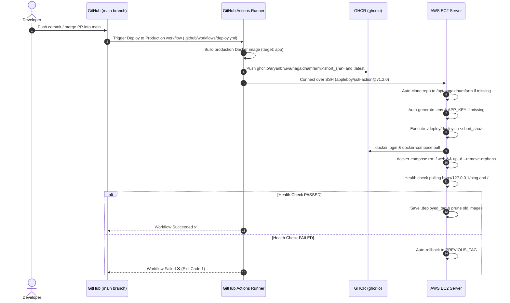

# Docker & Deployment Setup Guide

This document provides the complete Docker setup guide for local development (Section 1) and production deployment on AWS EC2 (Section 2).

---

# SECTION 1: DEVELOPER (Local Development)

## 1. Local Docker Architecture

```mermaid
flowchart TD
    HostBrowser["Developer Browser (http://localhost:8080)"] -->|Port 8080| DevWeb["Container: nagaldham_dev_web (nginx:1.27-alpine)"]
    DevWeb -->|FastCGI / Port 9000| DevApp["Container: nagaldham_dev_app (php:8.4-fpm-alpine)"]
    DevWeb -->|Bind Mount| HostCode["Host Repository Root (..)"]
    DevApp -->|Bind Mount (Live Reloading)| HostCode
```

### Developer Services Specification Table

| Service Name | Container Name | Base Image | Published Ports | Volume Mounts | Purpose |
|---|---|---|---|---|---|
| `app` | `nagaldham_dev_app` | Built from `docker-developer/Dockerfile.dev` | None (internal 9000) | `..:/var/www/html` | PHP 8.4-FPM runtime executing application code with live bind-mount reloading |
| `web` | `nagaldham_dev_web` | `nginx:1.27-alpine` | `${DEV_PORT:-8080}:80` | `./nginx.dev.conf:/etc/nginx/conf.d/default.conf:ro`, `..:/var/www/html:ro` | Nginx web server handling HTTP requests and serving static assets |

---

## 2. Docker Files Explanation

| File | Primary Purpose | When Used | What to Edit | What NOT to Edit |
|---|---|---|---|---|
| `docker-developer/docker-compose.dev.yml` | Local developer Docker Compose specification | Local development | Service ports (`DEV_PORT`), environment flags | Network definitions unless adding new services |
| `docker-developer/Dockerfile.dev` | Developer PHP 8.4-FPM container build recipe | Local image build | Additional PHP extensions or CLI tools | Base image tag unless upgrading PHP version |
| `docker-developer/nginx.dev.conf` | Developer Nginx server block configuration | Local Nginx container runtime | Nginx routing rules or static headers | `fastcgi_pass app:9000` upstream target |
| `docker-developer/Makefile` | Shortcut commands for local container management | Local developer shell workflow | Add custom developer targets | Existing compose file references |
| `Dockerfile` | Multi-stage production container build recipe | Production image build & GHCR push | Production PHP extensions or asset build steps | Multi-stage target names (`app`, `assets`) |
| `docker-compose.yml` | Main production Docker Compose specification | Production EC2 server runtime | Environment file references, port bindings | Internal container network aliases |
| `docker-compose.build.yml` | Override file for local production image building | Local production build testing | None | Target build context |
| `.dockerignore` | Defines files excluded from Docker build context | `docker build` commands | Add heavy local folders (`node_modules`, `.git`) | Core application paths |
| `docker/entrypoint.sh` | Production PHP container entrypoint script | App container startup | Add startup tasks (e.g. migration checks) | `exec "$@"` final execution line |
| `docker/nginx/default.conf` | Production Nginx server block configuration | Production web container runtime | Domain names, SSL certificate paths | FastCGI upstream proxy settings |

---

## 3. Prerequisites

* **Docker Engine:** Version 20.10.0 or higher.
* **Docker Compose:** Version v2.27.0 or higher.
* **Git:** Installed on local host machine.
* **User Permissions:** User must be added to the `docker` system group (`sudo usermod -aG docker $USER && newgrp docker`).

---

## 4. Local Setup Step by Step

### Step 1: Clone Repository
```bash
git clone git@github.com:Aryanbhuva/nagaldhamfarm.git
cd nagaldhamfarm
```

### Step 2: Configure Environment File
```bash
cp .env.example .env
```

### Step 3: Build Developer Docker Images
```bash
make -f docker-developer/Makefile build
```

### Step 4: Start Developer Containers
```bash
make -f docker-developer/Makefile up
```

### Step 5: Verify Running Stack
```bash
# Check container status
docker-compose -f docker-developer/docker-compose.dev.yml ps

# Test health check endpoint
curl -i http://localhost:8080/ping
```

Expected response: `HTTP/1.1 200 OK` with body `pong`.

---

## 5. Daily Developer Workflow

```bash
# Start containers at beginning of work
make -f docker-developer/Makefile up

# Stream container logs
make -f docker-developer/Makefile logs

# Access bash shell inside app container
make -f docker-developer/Makefile shell

# Run Laravel migrations
make -f docker-developer/Makefile artisan CMD="migrate"

# Run Composer dependency install
make -f docker-developer/Makefile composer CMD="install"

# Clear Laravel caches
make -f docker-developer/Makefile clean-cache

# Stop containers at end of work
make -f docker-developer/Makefile down
```

---

## 6. Local Troubleshooting

| Error / Symptom | Likely Cause | Fix Command |
|---|---|---|
| `permission denied while trying to connect to Docker daemon` | User not in `docker` group | `sudo usermod -aG docker $USER && newgrp docker` |
| `port is already allocated: 8080` | Local port 8080 in use by another app | Set `DEV_PORT=8090` in `.env` then run `make -f docker-developer/Makefile up` |
| `Class 'App\Http\Controllers\...' not found` | Autoload cache out of date | `make -f docker-developer/Makefile composer CMD="dump-autoload"` |
| `No application encryption key has been specified` | `APP_KEY` missing in `.env` | `make -f docker-developer/Makefile key` |

---

# SECTION 2: PRODUCTION (AWS EC2 & CI/CD Deployment)

---

## 1. Server Overview

| Property | Value / Specification |
|---|---|
| Server Name / Host | AWS EC2 Standalone Instance |
| Public IP / Hostname | `EC2_HOST` secret (e.g. `<EC2_PUBLIC_IP>`) |
| Domain Name | `https://nagaldhamfarm.shop` & `https://www.nagaldhamfarm.shop` |
| Role | Production Web & Application Server |
| Operating System | Ubuntu 22.04 LTS (x86_64) |
| System User | `deploy` (member of `docker` group) |
| SSH Port | `22` (configurable via `EC2_SSH_PORT`) |

### Production Architecture Diagram

```mermaid
flowchart TD
    Client["Client Browser"] -->|HTTPS (443) / HTTP (80)| HostNginx["Host Ports 80 / 443"]
    HostNginx --> WebContainer["Nginx Container (nagaldham_web)"]
    WebContainer -->|SSL Certs| CertPath["/etc/letsencrypt/live/nagaldhamfarm.shop/"]
    WebContainer -->|Static Assets| PublicDir["./public (bind mount)"]
    WebContainer -->|FastCGI app:9000| AppContainer["PHP 8.4 Container (nagaldham_app)"]
    AppContainer -->|Storage Data| StorageVol["Volume: nagaldham_storage_data"]
    AppContainer -.-> DBServer["Database (TODO: confirm host)"]
```

---

## 2. Server Project Paths Table

| Path on Server | Purpose |
|---|---|
| `/opt/nagaldhamfarm` | Main project root directory on EC2 host |
| `/opt/nagaldhamfarm/docker-compose.yml` | Active production Docker Compose configuration |
| `/opt/nagaldhamfarm/.env` | Server environment configuration file (contains `IMAGE_TAG` and `APP_KEY`) |
| `/opt/nagaldhamfarm/.deployed_tag` | Record of currently running deployed image tag |
| `/opt/nagaldhamfarm/deploy/deploy.sh` | Automated deployment script executed by SSH action |
| `/opt/nagaldhamfarm/deploy/rollback.sh` | Manual rollback script |
| `/opt/nagaldhamfarm/public/` | Public asset directory bind-mounted to web and app containers |
| `/etc/letsencrypt/` | Host Let's Encrypt SSL certificates mounted into web container |
| `/var/lib/docker/volumes/nagaldham_storage_data/_data` | Persistent storage directory for Laravel storage |

---

## 3. First-Time Server Setup from Scratch

To set up a fresh Ubuntu 22.04 LTS EC2 instance, execute the automated bootstrap script [scripts/bootstrap_server.sh](file:///home/vishmay/Desktop/project/scripts/bootstrap_server.sh):

```bash
# 1. Download or transfer bootstrap script to fresh server
curl -sSL https://raw.githubusercontent.com/Aryanbhuva/nagaldhamfarm/main/scripts/bootstrap_server.sh -o /tmp/bootstrap_server.sh

# 2. Make executable and run as root
chmod +x /tmp/bootstrap_server.sh
sudo /tmp/bootstrap_server.sh
```

### Manual Step-by-Step Command Breakdown

```bash
# 1. Update system packages
sudo apt-get update -y && sudo apt-get upgrade -y

# 2. Configure 2 GB Swap file
sudo fallocate -l 2G /swapfile
sudo chmod 600 /swapfile
sudo mkswap /swapfile
sudo swapon /swapfile
echo '/swapfile none swap sw 0 0' | sudo tee -a /etc/fstab

# 3. Install Docker Engine
curl -fsSL https://get.docker.com -o get-docker.sh && sudo sh get-docker.sh

# 4. Install Docker Compose v2.27.0
sudo curl -SL "https://github.com/docker/compose/releases/download/v2.27.0/docker-compose-linux-x86_64" -o /usr/local/bin/docker-compose
sudo chmod +x /usr/local/bin/docker-compose

# 5. Create deploy user & SSH directory
sudo useradd -m -s /bin/bash deploy
sudo usermod -aG docker deploy
sudo mkdir -p /home/deploy/.ssh && sudo chmod 700 /home/deploy/.ssh
sudo touch /home/deploy/.ssh/authorized_keys && sudo chmod 600 /home/deploy/.ssh/authorized_keys
sudo chown -R deploy:deploy /home/deploy/.ssh

# 6. Setup project directory
sudo mkdir -p /opt/nagaldhamfarm
sudo chown -R deploy:deploy /opt/nagaldhamfarm

# 7. Configure SSL directory permissions
sudo chmod +rx /etc/letsencrypt /etc/letsencrypt/live /etc/letsencrypt/archive
```

---

## 4. GitHub / CI-CD Workflow

### Pipeline Execution Diagram



### Required CI/CD Variables & Secrets

Configure these secrets in GitHub under **Settings → Secrets and variables → Actions**:

| Secret Name | Where to Set | Purpose | Example Placeholder |
|---|---|---|---|
| `EC2_HOST` | GitHub Repository Secrets | EC2 instance public IP address | `<EC2_PUBLIC_IP>` |
| `EC2_USER` | GitHub Repository Secrets | Remote SSH username | `deploy` |
| `EC2_SSH_KEY` | GitHub Repository Secrets | Private SSH key for `deploy` user | `<SSH_PRIVATE_KEY>` |
| `EC2_SSH_PORT` | GitHub Repository Secrets | Remote SSH port | `22` |
| `GHCR_PAT` | GitHub Repository Secrets | GitHub Personal Access Token (`read:packages` scope) | `<GITHUB_TOKEN>` |

---

## 5. Secrets and Access Checklist

Before deploying, ensure you have gathered and configured the following access items:

1. **Deploy SSH Key Pair:**
   ```bash
   # Generate key pair on server for deploy user
   sudo -u deploy ssh-keygen -t ed25519 -N "" -f /home/deploy/.ssh/id_ed25519
   
   # Output Public Key (Add to GitHub -> Settings -> Deploy keys)
   sudo cat /home/deploy/.ssh/id_ed25519.pub
   
   # Output Private Key (Add to GitHub -> Settings -> Secrets -> Actions -> EC2_SSH_KEY)
   sudo cat /home/deploy/.ssh/id_ed25519
   ```

2. **Test SSH Access from Local Machine:**
   ```bash
   ssh -i <PATH_TO_PRIVATE_KEY> deploy@<EC2_PUBLIC_IP>
   ```

3. **Test GitHub SSH Authentication:**
   ```bash
   ssh -T git@github.com
   ```
   Expected response: `Hi Aryanbhuva/nagaldhamfarm! You've successfully authenticated...`

---

## 6. DISASTER RECOVERY: "Server Deleted? Rebuild in 15 Minutes"

If the AWS EC2 instance is terminated or deleted, follow this 15-minute recovery checklist:

1. **Provision New EC2 Instance:** Launch a new Ubuntu 22.04 LTS instance on AWS EC2 and attach your Elastic IP (`<EC2_PUBLIC_IP>`).
2. **Execute Bootstrap Script:**
   ```bash
   ssh ubuntu@<EC2_PUBLIC_IP>
   curl -sSL https://raw.githubusercontent.com/Aryanbhuva/nagaldhamfarm/main/scripts/bootstrap_server.sh -o /tmp/bootstrap_server.sh
   chmod +x /tmp/bootstrap_server.sh
   sudo /tmp/bootstrap_server.sh
   ```
3. **Update GitHub Secret `EC2_SSH_KEY`:** Copy the new private key output from the bootstrap script (`sudo cat /home/deploy/.ssh/id_ed25519`) into GitHub Secret `EC2_SSH_KEY`.
4. **Update GitHub Deploy Key:** Copy the public key (`sudo cat /home/deploy/.ssh/id_ed25519.pub`) into GitHub Repo Deploy Keys.
5. **Restore Let's Encrypt SSL Certificates:**
   ```bash
   # Copy backup certificates to /etc/letsencrypt on new server
   sudo mkdir -p /etc/letsencrypt
   # Restore certificates archive to /etc/letsencrypt
   ```
6. **Trigger Deployment Workflow:** Go to **GitHub Repo → Actions → Deploy to Production → Run workflow** (or push a commit to `main`).
7. **Verify Site Functionality:**
   ```bash
   curl -I https://nagaldhamfarm.shop/
   curl -I https://nagaldhamfarm.shop/products
   ```

---

## 7. Operations & Maintenance

### Manual Rollback

To manually revert the server to a specific container image tag:

```bash
ssh deploy@<EC2_PUBLIC_IP>
cd /opt/nagaldhamfarm
./deploy/rollback.sh <IMAGE_TAG_OR_SHA>
```

### Tail Production Container Logs

```bash
ssh deploy@<EC2_PUBLIC_IP>
cd /opt/nagaldhamfarm
docker-compose logs -f --tail=100
```

---

## 8. Production Troubleshooting Table

| Symptom | Cause | Diagnostic / Fix Command |
|---|---|---|
| SSH Action fails with `Host key verification failed` | Server `github.com` host key unverified | Fixed automatically by workflow; manually run `ssh-keyscan -H github.com >> ~/.ssh/known_hosts` |
| Container fails health check during deploy | Application error or key uninitialized | Check logs: `docker-compose logs --tail=100 app`; verify `.env` contains `APP_KEY` |
| `nginx: [emerg] open() "/etc/letsencrypt/..." failed` | SSL certs missing or permissions incorrect | Run `sudo chmod +rx /etc/letsencrypt /etc/letsencrypt/live` |
| `address already in use: 80 / 443` | Host Nginx or another process binding port | Stop host Nginx: `sudo systemctl stop nginx && sudo systemctl disable nginx` |

---

## 9. New Developer 5-Minute Onboarding Summary

1. Read [`README.md`](file:///home/vishmay/Desktop/project/README.md) to understand the project architecture and technology stack.
2. Clone the repository to your local computer (`git clone git@github.com:Aryanbhuva/nagaldhamfarm.git`).
3. Copy the local environment template (`cp .env.example .env`).
4. Ensure Docker Engine and Docker Compose are installed on your machine.
5. Build local developer containers using `make -f docker-developer/Makefile build`.
6. Start local developer containers using `make -f docker-developer/Makefile up`.
7. Open **[http://localhost:8080](http://localhost:8080)** in your browser.
8. Generate your local application key using `make -f docker-developer/Makefile key`.
9. Work on the `staging` branch for all feature development.
10. Push changes to `staging`, create a Pull Request to `main`, and merge to trigger automated deployment!
